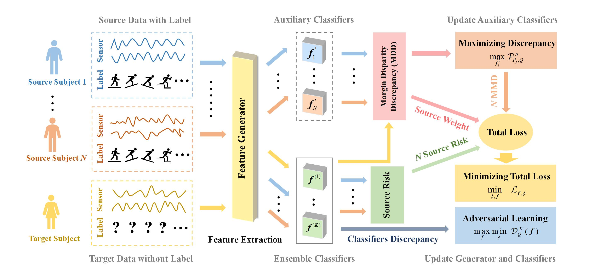

# A Theoretical-ground Multi-source Unsupervised Domain Adaptation Method for Human Motion Intention Recognition

[]

Code for WMDD: A Theoretical-ground Multi-source Unsupervised Domain Adaptation Method for Human Motion Intention Recognition. This paper extends the margin disparity discrepancy (MDD) theory in single-source unsupervised domain adaptation (UDA) to the multi-source UDA, and proposes a novel weighted multi-source UDA method, named WMMD, for HMI recognition. The implementation is based on [MDD](https://github.com/thuml/MDD) and [EDHKD](https://github.com/KuangenZhang/EDH).

<div style="text-align: center;">

</div>

## Installation

Install Python packages listed in `WMDD.yaml`.
   ```
   conda env create -f environment.yaml
   conda activate WMDD
   ```
   
## Training

The hyperparameters are automatically loaded from `configs`.

```bash
python run.py --eval_only False
```

## Testing

Just run `run.py` with specifying the task name.

```bash
python run.py --eval_only True
```

